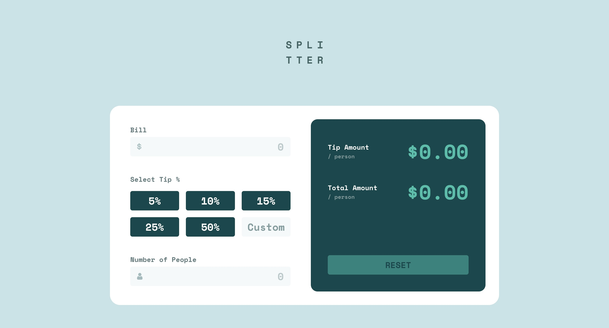

# Frontend Mentor - Tip calculator app solution

This is a solution to the [Tip calculator app challenge on Frontend Mentor](https://www.frontendmentor.io/challenges/tip-calculator-app-ugJNGbJUX). Frontend Mentor challenges help you improve your coding skills by building realistic projects.

## Table of contents

- [Overview](#overview)
  - [The challenge](#the-challenge)
  - [Screenshot](#screenshot)
  - [Links](#links)
- [My process](#my-process)
  - [Built with](#built-with)
  - [What I learned](#what-i-learned)
  - [Continued development](#continued-development)
  - [Useful resources](#useful-resources)
- [Author](#author)

## Overview

### The challenge

Users should be able to:

- View the optimal layout for the app depending on their device's screen size
- See hover states for all interactive elements on the page
- Calculate the correct tip and total cost of the bill per person

### Screenshot



### Links

- Solution URL: [Solution URL](https://github.com/Joshk7/tip-calculator)
- Live Site URL: [Live Site URL](https://tip-calculator-three-rust.vercel.app)

## My process

I started by building out the html, css, and then the javascript. Initially, I made the tip percentage buttons as generic button inputs but then changed them to radio buttons. Additionally, I redid the html to include a fieldset for each main input.

### Built with

- Semantic HTML5 markup
- CSS custom properties
- Flexbox
- CSS Grid
- Mobile-first workflow

### What I learned

I learned a little more about javascript and how to handle form input events. This whole project is just a giant form that changes calculated amounts every time the form gets input.

```js
const handleFormInput = (e) => {
    disableButton();
    const { bill, percent, people } = formData();
    const valid = validate(bill, people);
    if (bill === 0) {
        return;
    }

    if (!valid) {
        renderError();
    } else {
        const tipAmount = calculateTip(bill, percent, people);
        const totalAmount = calculateTotal(bill, people);
        tip.innerText = `$${tipAmount}`;
        total.innerText = `$${totalAmount}`;
        clearError(); 
    }
}
```

### Continued development

I could possibly clean up the javascript in this project so that there are more utility functions help unclutter some of the event handlers.

## Author

- Website - [Joshua Kahlbaugh](https://joshuakahlbaugh.pages.dev/)
- Frontend Mentor - [@Joshk7](https://www.frontendmentor.io/profile/Joshk7)
